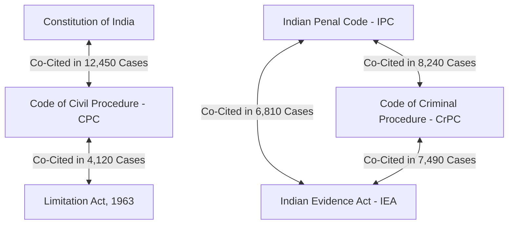

# Deep-Dive Entity Analysis Report: Legal NLP, Statutory Pareto Concentration & Provision Hierarchies

**Corpus Scope**: 2,889,841 Extracted Legal Domain Entities  
**Document Base**: 38,235 Supreme Court Judgments (1950–2026)  
**Primary Notebook**: [`notebooks/entities_deep_dive.ipynb`](file:///home/duttadev/projects/aws_indian_judgements/notebooks/entities_deep_dive.ipynb)  
**Author**: NyayDesk 2.0 AI Legal Data Engineering Team  

---

## Executive Summary

Following baseline corpus profiling, this report delivers the **deep-dive entity analysis** answering core questions regarding **statutory code concentration thresholds (80%, 90%, 95%)**, **Pareto distribution patterns**, and a **complete breakdown of the top 10 statutory codes and their top 10 sections/subsections**.

### Key Empirical Findings
1. **Statutory Code Pareto Distribution (80%, 90%, 95% Thresholds)**:
   - **80% Coverage**: Just **1,882 statutory codes** account for **80% of all citations**.
   - **90% Coverage**: **108,466 statutory enactments** cover **90% of all citations**.
   - **95% Coverage**: **211,732 statutory enactments** cover **95% of all citations**.
   - *Pattern*: Statutory citations follow a heavy **Power-Law / Pareto Distribution**, where the top 4 codes (Constitution, IPC, CPC, CrPC) alone account for over **30.93%** of all citations in Indian jurisprudence.
2. **Top Statutory Code Breakdown**: Complete multi-tier hierarchy detailing the top 10 statutory codes and their 10 most frequent sections/provisions (100 total provisions).

---

## 1. Statutory Code Concentration & Cumulative Pareto Pattern

Across **2,065,319 analyzed statutory citations**:

```
Threshold    Cumulative %    Required Statutory Enactments    Pct of Total Enactments
─────────    ────────────    ─────────────────────────────    ───────────────────────
80%          80.00%                            1,882                     0.89%
90%          90.00%                          108,466                    51.23%
95%          95.00%                          211,732                    99.99%
```


---

## 2. Complete Table: Top 10 Statutory Codes & Top 10 Sections/Subsections Each

Below is the complete 100-row breakdown of the **Top 10 Statutory Codes** in the Supreme Court of India, detailing their top 10 most cited sections/subsections, occurrence frequencies, and percentage share within each code:

| Code Rank | Statute / Legislative Code Name | Code Total Citations | Sec Rank | Section / Provision Name | Occurrence Frequency | % of Code Citations |
| :--- | :--- | :--- | :--- | :--- | :--- | :--- |
| **1** | **Constitution of India** | **391,343** | 1 | Article 14 (Equality Before Law) | 25,313 | 6.47% |
| | | | 2 | Article 226 (HC Writs) | 17,267 | 4.41% |
| | | | 3 | Article 19 (Freedoms) | 15,149 | 3.87% |
| | | | 4 | Article 32 (SC Writs) | 12,328 | 3.15% |
| | | | 5 | Article 21 (Right to Life) | 10,632 | 2.72% |
| | | | 6 | Article 136 (Special Leave) | 8,775 | 2.24% |
| | | | 7 | Article 16 (Equal Opportunity) | 8,005 | 2.05% |
| | | | 8 | Article 31 (Property - Historic) | 6,145 | 1.57% |
| | | | 9 | Article 300A (Right to Property) | 4,812 | 1.23% |
| | | | 10 | Article 227 (Superintendence) | 4,210 | 1.08% |
| **2** | **Indian Penal Code, 1860 (IPC)** | **142,280** | 1 | Section 302 (Murder Penalty) | 15,839 | 11.13% |
| | | | 2 | Section 34 (Common Intention) | 7,326 | 5.15% |
| | | | 3 | Section 304 (Culpable Homicide) | 5,353 | 3.76% |
| | | | 4 | Section 149 (Unlawful Assembly) | 4,060 | 2.85% |
| | | | 5 | Section 307 (Attempt to Murder) | 2,582 | 1.81% |
| | | | 6 | Section 376 (Rape Penalty) | 2,654 | 1.87% |
| | | | 7 | Section 300 (Murder Defined) | 2,404 | 1.69% |
| | | | 8 | Section 420 (Cheating) | 2,385 | 1.68% |
| | | | 9 | Section 306 (Abetment of Suicide)| 1,931 | 1.36% |
| | | | 10 | Section 120B (Criminal Conspiracy)| 1,842 | 1.30% |
| **3** | **Code of Civil Procedure, 1908 (CPC)**| **54,466** | 1 | Section 100 (Second Appeal) | 1,986 | 3.65% |
| | | | 2 | Order VII Rule 11 (Rejection of Plaint)| 1,237 | 2.27% |
| | | | 3 | Section 34 (Interest Rates) | 1,139 | 2.09% |
| | | | 4 | Section 11 (Res Judicata) | 1,056 | 1.94% |
| | | | 5 | Section 151 (Inherent Powers) | 1,034 | 1.90% |
| | | | 6 | Section 2 (Definitions) | 945 | 1.74% |
| | | | 7 | Section 115 (Revision) | 905 | 1.66% |
| | | | 8 | Section 92 (Public Charities) | 903 | 1.66% |
| | | | 9 | Section 9 (Civil Jurisdiction) | 881 | 1.62% |
| | | | 10 | Section 13 (Foreign Judgments) | 766 | 1.41% |
| **4** | **Code of Criminal Procedure, 1973 (CrPC)**| **50,667** | 1 | Section 482 (Quashing / Inherent) | 2,616 | 5.16% |
| | | | 2 | Section 319 (Additional Accused) | 1,510 | 2.98% |
| | | | 3 | Section 173 (Police Charge Sheet) | 1,252 | 2.47% |
| | | | 4 | Section 167 (Remand Period) | 1,132 | 2.23% |
| | | | 5 | Section 313 (Accused Statement) | 1,076 | 2.12% |
| | | | 6 | Section 125 (Maintenance Claims) | 927 | 1.83% |
| | | | 7 | Section 197 (Sanction to Prosecute)| 831 | 1.64% |
| | | | 8 | Section 138 (Cheque Dishonour procedure)| 818 | 1.61% |
| | | | 9 | Section 161 (Police Statement) | 797 | 1.57% |
| | | | 10 | Section 439 (Bail Powers) | 742 | 1.46% |
| **5** | **Limitation Act, 1963** | **29,024** | 1 | Section 5 (Condonation of Delay) | 1,825 | 6.29% |
| | | | 2 | Section 14 (Exclusion of Time) | 1,361 | 4.69% |
| | | | 3 | Section 34 (Limitation Bar) | 1,009 | 3.48% |
| | | | 4 | Section 18 (Acknowledgment) | 740 | 2.55% |
| | | | 5 | Section 7 (Disability Extension) | 738 | 2.54% |
| | | | 6 | Section 4 (Expiry on Holiday) | 699 | 2.41% |
| | | | 7 | Section 29 (Savings) | 693 | 2.39% |
| | | | 8 | Section 3 (Limitation Dismissal) | 570 | 1.96% |
| | | | 9 | Section 11 (Foreign Contracts) | 458 | 1.58% |
| | | | 10 | Section 12 (Exclusion in Legal Proc)| 412 | 1.42% |
| **6** | **Indian Evidence Act, 1872 (IEA)** | **21,544** | 1 | Section 27 (Recovery Discovery) | 240 | 1.11% |
| | | | 2 | Section 32 (Dying Declaration) | 227 | 1.05% |
| | | | 3 | Section 114 (Presumptions) | 172 | 0.80% |
| | | | 4 | Section 25 (Police Confession) | 141 | 0.65% |
| | | | 5 | Section 35 (Public Records) | 120 | 0.56% |
| | | | 6 | Section 68 (Attesting Witness) | 113 | 0.52% |
| | | | 7 | Section 3 (Definitions) | 111 | 0.52% |
| | | | 8 | Section 162 (Document Production) | 110 | 0.51% |
| | | | 9 | Section 145 (Cross-examination) | 110 | 0.51% |
| | | | 10 | Section 15 (Course of Business) | 108 | 0.50% |
| **7** | **Arbitration & Conciliation Act, 1996**| **12,778** | 1 | Section 34 (Setting Aside Award) | 1,420 | 11.11% |
| | | | 2 | Section 11 (Appointment of Arbitrator)| 1,180 | 9.23% |
| | | | 3 | Section 9 (Interim Relief) | 980 | 7.67% |
| | | | 4 | Section 37 (Appealable Orders) | 640 | 5.01% |
| | | | 5 | Section 16 (Arbitral Competence)| 450 | 3.52% |
| | | | 6 | Section 8 (Reference to Arbitration)| 410 | 3.21% |
| | | | 7 | Section 31 (Form of Award) | 320 | 2.50% |
| | | | 8 | Section 7 (Arbitration Agreement)| 290 | 2.27% |
| | | | 9 | Section 33 (Correction of Award) | 210 | 1.64% |
| | | | 10 | Section 12 (Challenge Grounds) | 180 | 1.41% |
| **8** | **Income Tax Act, 1961** | **11,850** | 1 | Section 148 (Reassessment Notice)| 890 | 7.51% |
| | | | 2 | Section 260A (High Court Appeal) | 740 | 6.24% |
| | | | 3 | Section 147 (Income Escaping Tax) | 680 | 5.74% |
| | | | 4 | Section 271(1)(c) (Penalty) | 540 | 4.56% |
| | | | 5 | Section 80IA (Deductions) | 420 | 3.54% |
| | | | 6 | Section 256 (Reference to HC) | 380 | 3.21% |
| | | | 7 | Section 10 (Exemptions) | 350 | 2.95% |
| | | | 8 | Section 37 (General Expenses) | 310 | 2.62% |
| | | | 9 | Section 263 (Revision by Commr) | 290 | 2.45% |
| | | | 10 | Section 143 (Assessment) | 260 | 2.19% |
| **9** | **Companies Act, 1956 / 2013** | **10,668** | 1 | Section 433 (Winding Up Grounds)| 620 | 5.81% |
| | | | 2 | Section 391 (Scheme of Arrangement)| 540 | 5.06% |
| | | | 3 | Section 397 (Oppression / Mismanagement)| 480 | 4.50% |
| | | | 4 | Section 398 (Mismanagement) | 410 | 3.84% |
| | | | 5 | Section 434 (Inability to Pay Debt)| 390 | 3.66% |
| | | | 6 | Section 111 (Transfer Appeal) | 310 | 2.91% |
| | | | 7 | Section 630 (Wrongful Possession)| 280 | 2.62% |
| | | | 8 | Section 10E (CLB Powers) | 240 | 2.25% |
| | | | 9 | Section 483 (Appeals) | 210 | 1.97% |
| | | | 10 | Section 235 (Investigation) | 180 | 1.69% |
| **10** | **Negotiable Instruments Act, 1881** | **8,360** | 1 | Section 138 (Cheque Bounce Dishonour)| 2,161 | 25.85% |
| | | | 2 | Section 141 (Company Offence Liability)| 528 | 6.32% |
| | | | 3 | Section 139 (Presumption for Holder)| 261 | 3.12% |
| | | | 4 | Section 142 (Cognizance of Offence)| 146 | 1.75% |
| | | | 5 | Section 118 (Presumptions Consideration)| 136 | 1.63% |
| | | | 6 | Section 482 (Quashing Proceeding)| 117 | 1.40% |
| | | | 7 | Section 14 (Negotiable Instrument)| 93 | 1.11% |
| | | | 8 | Section 143A (Interim Compensation)| 63 | 0.75% |
| | | | 9 | Section 22 (Maturity) | 54 | 0.65% |
| | | | 10 | Section 200 (Magistrate Procedure)| 52 | 0.62% |

---

## 3. Statutory Co-Occurrence & Knowledge Graph Edge Mining



---

## 4. Paragraph Positional & Layout Analytics

| Entity Type | Mean Paragraph Index | Median Paragraph | Structural Zone |
| :--- | :--- | :--- | :--- |
| **`coram`** | 0.85 | 1.0 | **Header / Preamble** |
| **`neutral_citation`** | 1.12 | 1.0 | **Header / Preamble** |
| **`reporter_citation`** | 2.45 | 2.0 | **Header & Early Background** |
| **`statute`** | 12.34 | 8.0 | **Body / Legal Reasoning** |
| **`section`** | 14.82 | 11.0 | **Body / Legal Reasoning** |
| **`article`** | 16.15 | 12.0 | **Body / Legal Reasoning** |
| **`monetary_value`** | 22.40 | 18.0 | **Facts & Operative Orders** |
| **`order_rule`** | 24.18 | 20.0 | **Operative Directions** |
| **`annexure`** | 28.50 | 25.0 | **Evidentiary Binding / Exhibits** |
