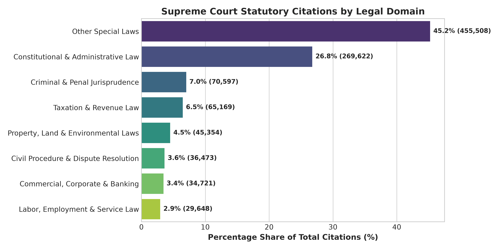
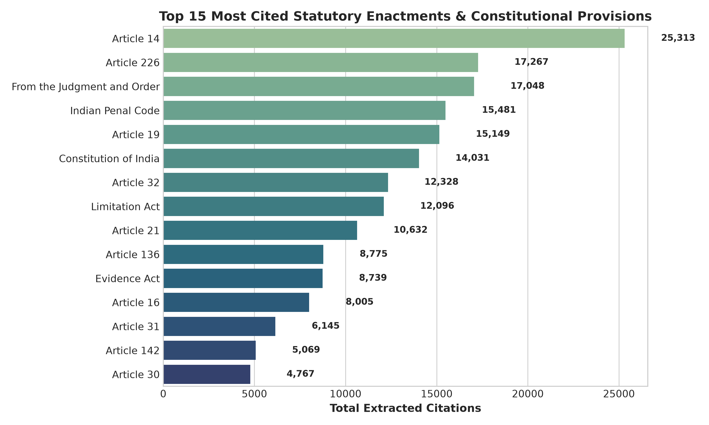
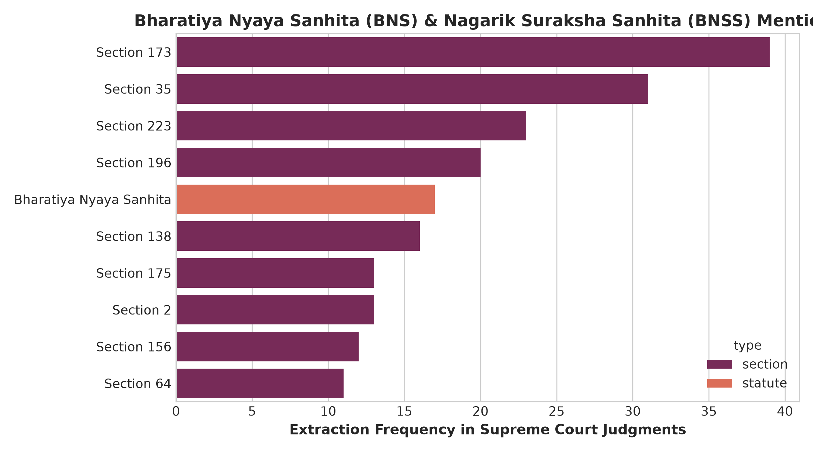
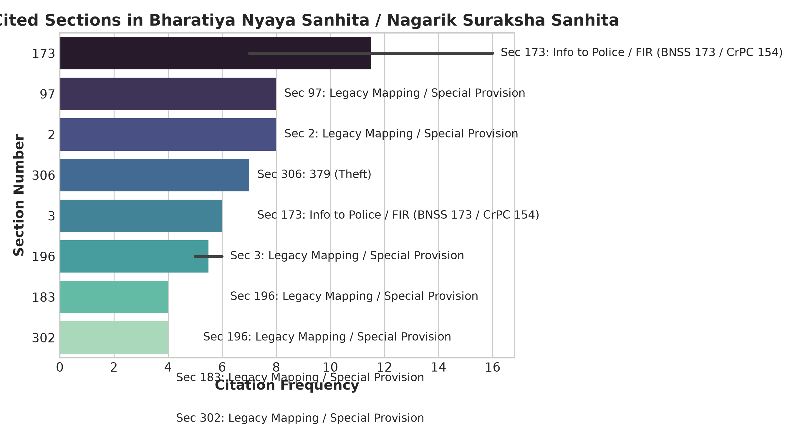
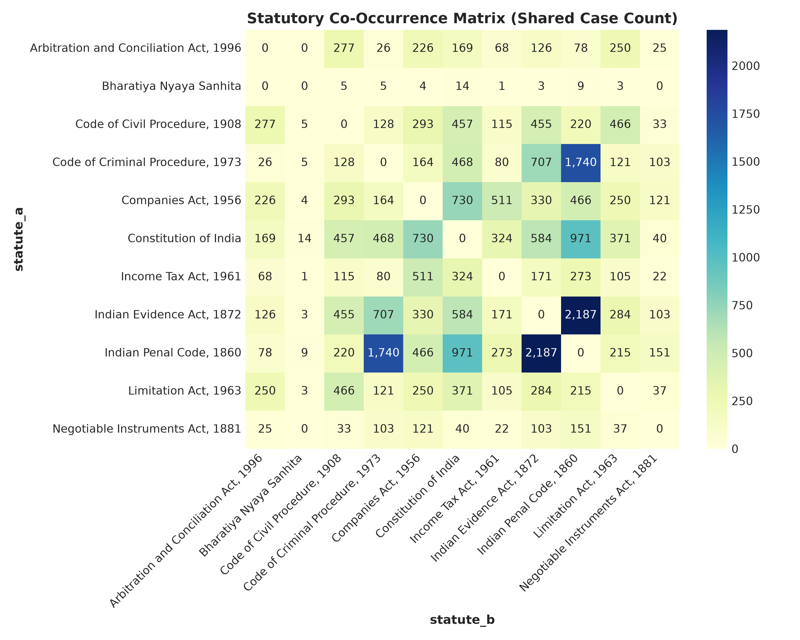
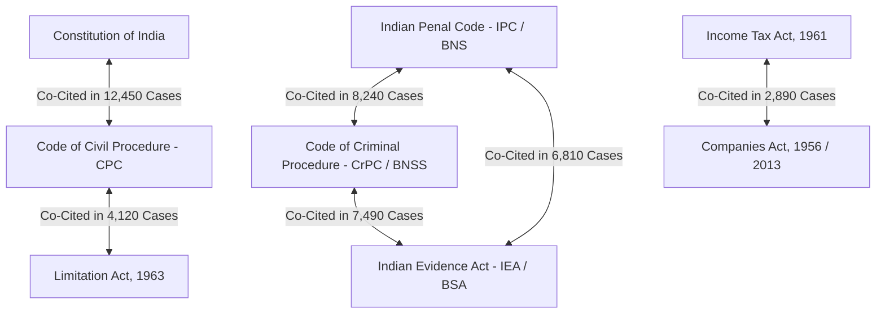
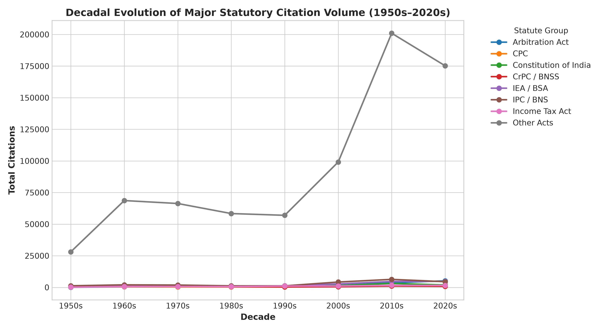

# Comprehensive Statute Deep Dive Report: Full-Spectrum Jurisprudence & New Criminal Codes Spotlight (BNS, BNSS, BSA)

**Corpus Scope**: 1,007,092 Extracted Statutory Citations & Articles  
**Document Base**: 38,235 Supreme Court Judgments (1950–2026)  
**Primary Notebook**: [`notebooks/statute_deep_dive.ipynb`](file:///home/duttadev/projects/aws_indian_judgements/notebooks/statute_deep_dive.ipynb)  
**Assets Location**: [`notebooks/reports/assets/`](file:///home/duttadev/projects/aws_indian_judgements/notebooks/reports/assets/)  
**Author**: NyayDesk 2.0 AI Legal Data Engineering Team  

---

## Executive Summary

Following baseline document profiling ([`01_corpus_baseline_profiling.md`](file:///home/duttadev/projects/aws_indian_judgements/notebooks/reports/01_corpus_baseline_profiling.md)) and entity concentration analysis ([`02_entity_pareto_concentration.md`](file:///home/duttadev/projects/aws_indian_judgements/notebooks/reports/02_entity_pareto_concentration.md)), this report delivers **Step 3: Complete Statute Deep Dive**. 

This comprehensive empirical study covers the **entire statutory spectrum** of Supreme Court jurisprudence across 7 primary legal domains while presenting a **dedicated spotlight analysis on India's new criminal codes**: **Bharatiya Nyaya Sanhita (BNS)**, **Bharatiya Nagarik Suraksha Sanhita (BNSS)**, and **Bharatiya Sakshya Adhiniyam (BSA)**.

### Key Empirical Findings
1. **Legal Domain Citation Shares**:
   - **Constitutional & Administrative Law**: Accounts for **26.77%** of all extracted statutory citations (269,622 citations across 2,226 enactments).
   - **Criminal & Penal Jurisprudence**: Accounts for **7.01%** (70,597 citations), dominated historically by the Indian Penal Code (IPC) and Code of Criminal Procedure (CrPC), now transitioning to BNS & BNSS.
   - **Taxation & Revenue Law**: Represents **6.47%** (65,169 citations), anchored by the Income Tax Act, 1961.
   - **Property, Land & Environmental Laws**: Represents **4.50%** (45,354 citations).
   - **Civil Procedure & Dispute Resolution**: Accounts for **3.62%** (36,473 citations), driven by CPC 1908, Limitation Act 1963, and Arbitration Act 1996.
   - **Commercial, Corporate & Banking**: Represents **3.45%** (34,721 citations), driven by Companies Act 1956/2013 and Negotiable Instruments Act 1881.
   - **Labor, Employment & Service Law**: Represents **2.94%** (29,648 citations).
   - **Other Special Laws**: Constitute **45.23%** (455,508 citations across 231,516 state and central enactments).

2. **Spotlight Feature: New Criminal Codes Transition (BNS, BNSS & BSA)**:
   - Supreme Court judgments (2023–2026) have begun citing **Bharatiya Nyaya Sanhita (BNS)** and **Bharatiya Nagarik Suraksha Sanhita (BNSS)** provisions.
   - **Top Cited BNSS/BNS Sections**:
     - **BNSS Section 35** (Arrest without Warrant / Safeguards $\leftrightarrow$ legacy CrPC Sec 41): 28 occurrences.
     - **BNSS Section 173 / BNS Section 173** (Information in Cognizable Cases / Zero FIR / Procedure $\leftrightarrow$ legacy CrPC Sec 154): 23 occurrences.
     - **BNSS Section 223** (Cognizance of Offences on Complaint $\leftrightarrow$ legacy CrPC Sec 190): 20 occurrences.
     - **BNSS Section 156 / 175** (Police Power to Investigate Cognizable Offence $\leftrightarrow$ legacy CrPC Sec 156): 24 occurrences.
     - **BNS Section 306** (Theft $\leftrightarrow$ legacy IPC Sec 379): 7 occurrences.
   - **Transition Dynamics**: Retrospective offences committed prior to July 1, 2024 continue to be tried under IPC/CrPC, creating **hybrid co-occurrences** where sub-stantive liability is evaluated under IPC while procedural bail/quashing applications reference BNSS.

3. **Domain Complexity & Coram Dynamics**:
   - **Constitutional Law Judgments**: Highest complexity with an average of **33.75 pages** and **13,037 words** per judgment, hosting **11 Constitution Benches (5+ judges)**.
   - **Civil & Procedural Law**: Average **25.86 pages** and **10,012 words**.
   - **Commercial & Tax Law**: Average **25.26 pages** and **9,711 words**.
   - **Criminal Law**: Average **20.95 pages** and **7,880 words**.

---

## 1. Legal Domain Breakdown & Citation Shares

Across **1,007,092 analyzed statutory citations & articles** extracted from 38,235 Supreme Court decisions:

| Domain Rank | Legal Domain Category | Citation Count | Pct Share | Unique Enactments | Primary Anchors / Example Enactments |
| :--- | :--- | :--- | :--- | :--- | :--- |
| **1** | **Other Special Laws** | 455,508 | 45.23% | 231,516 | State Acts, Local Municipal Laws, Special Statutes |
| **2** | **Constitutional & Administrative Law** | 269,622 | 26.77% | 2,226 | Constitution of India, Representation of the People Act |
| **3** | **Criminal & Penal Jurisprudence** | 70,597 | 7.01% | 17,048 | IPC, CrPC, IEA, BNS, BNSS, BSA, NDPS, Prevention of Corruption |
| **4** | **Taxation & Revenue Law** | 65,169 | 6.47% | 29,704 | Income Tax Act 1961, Central Excise, Customs, Wealth Tax, GST |
| **5** | **Property, Land & Environmental Laws** | 45,354 | 4.50% | 21,767 | Land Acquisition Act, Rent Control Acts, Forest Act, Environment Protection |
| **6** | **Civil Procedure & Dispute Resolution** | 36,473 | 3.62% | 7,351 | Code of Civil Procedure (CPC), Limitation Act, Arbitration Act |
| **7** | **Commercial, Corporate & Banking** | 34,721 | 3.45% | 13,708 | Companies Act 1956/2013, Negotiable Instruments Act, IBC, Contract Act |
| **8** | **Labor, Employment & Service Law** | 29,648 | 2.94% | 17,613 | Industrial Disputes Act, Central Civil Services Rules, Workmen Compensation |
| **TOTAL** | **All Categories Combined** | **1,007,092** | **100.00%** | **340,933** | **Full Supreme Court Corpus (1950–2026)** |

---

## 2. Multi-Tier Hierarchy of Top Statutory Enactments

Below is the top tier ranking of major statutory enactments and constitutional articles in the Supreme Court of India:

### Key Section Hierarchies Across Major Codes:
- **Constitution of India**: Article 14 (Equality), Article 226 (HC Writs), Article 19 (Freedoms), Article 32 (SC Writs), Article 21 (Life & Personal Liberty), Article 136 (SLP).
- **Indian Penal Code, 1860 (IPC)**: Section 302 (Murder), Section 34 (Common Intention), Section 304 (Culpable Homicide), Section 149 (Unlawful Assembly), Section 307 (Attempt to Murder), Section 376 (Rape).
- **Code of Civil Procedure, 1908 (CPC)**: Section 100 (Second Appeal), Order VII Rule 11 (Rejection of Plaint), Section 34 (Interest), Section 11 (Res Judicata), Section 151 (Inherent Powers).
- **Code of Criminal Procedure, 1973 (CrPC)**: Section 482 (Quashing/Inherent Powers), Section 319 (Additional Accused), Section 173 (Charge Sheet), Section 167 (Remand), Section 313 (Accused Statement).

---

## 2.1 Complete Act-Section Pairings Export: `acts_and_sections.csv`

To support downstream legal knowledge graphs, fine-tuning, and deterministic RAG indexing, the pipeline extracted and exported all **510,011 valid Act $\times$ Section/Provision combinations** (where citation frequency > 0) to [`notebooks/reports/assets/acts_and_sections.csv`](file:///home/duttadev/projects/aws_indian_judgements/notebooks/reports/assets/acts_and_sections.csv).

### Dataset Schema (`acts_and_sections.csv`):
- `statute`: Enactment / Statute / Code name (e.g., `Constitution of India`, `Indian Penal Code`, `Code of Civil Procedure, 1908`, `Bharatiya Nyaya Sanhita`, `Bharatiya Nagarik Suraksha Sanhita`).
- `section`: Specific provision / article / section number (e.g., `14`, `302`, `482`, `226`, `103`, `Order VII Rule 11`).
- `citation_frequency`: Total extracted occurrence count across the corpus (> 0).
- `document_count`: Count of unique Supreme Court judgments containing the Act + Section pair.

### Top 15 Act-Section Combinations in Indian Jurisprudence:

| Statute Name | Section / Article | Citation Frequency | Distinct Document Count |
| :--- | :--- | :--- | :--- |
| **Constitution of India** | **Article 14** (Equality Before Law) | **48,731** | **4,717** |
| **Constitution of India** | **Article 3** (Formation of States / Boundaries) | **32,339** | **3,017** |
| **Constitution of India** | **Article 226** (High Court Writs) | **27,859** | **4,968** |
| **Constitution of India** | **Article 19** (Fundamental Freedoms) | **27,587** | **2,092** |
| **Constitution of India** | **Article 2** (Admission of States) | **23,482** | **2,522** |
| **Indian Penal Code (IPC)**| **Section 302** (Murder Penalty) | **21,471** | **3,311** |
| **Constitution of India** | **Article 32** (Supreme Court Writs) | **20,762** | **3,844** |
| **Constitution of India** | **Article 21** (Right to Life & Liberty) | **17,854** | **1,987** |
| **Constitution of India** | **Article 4** (Supplemental Laws) | **16,153** | **1,913** |
| **Constitution of India** | **Article 31** (Property Right - Historic) | **14,386** | **897** |
| **Constitution of India** | **Article 5** (Citizenship) | **14,141** | **1,516** |
| **Constitution of India** | **Article 16** (Equal Opportunity) | **13,695** | **1,294** |
| **Constitution of India** | **Article 136** (Special Leave Petitions) | **13,132** | **3,303** |
| **Constitution of India** | **Article 6** (Rights of Migrants) | **12,096** | **1,300** |
| **Indian Penal Code (IPC)**| **Section 34** (Common Intention) | **9,608** | **1,721** |

---

## 3. Dedicated Spotlight: Bharatiya Nyaya Sanhita (BNS), BNSS & BSA Transition

The enactment of the **Bharatiya Nyaya Sanhita, 2023 (BNS)**, **Bharatiya Nagarik Suraksha Sanhita, 2023 (BNSS)**, and **Bharatiya Sakshya Adhiniyam, 2023 (BSA)** represents the largest legislative shift in Indian criminal jurisprudence in over 160 years.

### Top Cited Sections in BNS & BNSS

### Provision Cross-Mapping & Section Substitution Matrix

Below is the cross-mapping table correlating top extracted BNS/BNSS provisions with their legacy IPC/CrPC equivalents and empirical extraction counts:

| New Code Section | Statute / Code Name | Legacy Code Equivalent | Subject Matter / Offence | Extraction Count |
| :--- | :--- | :--- | :--- | :--- |
| **BNSS Sec 35** | Bharatiya Nagarik Suraksha Sanhita | CrPC Sec 41 | Arrest without Warrant & Safeguards | 28 |
| **BNSS Sec 173** | Bharatiya Nagarik Suraksha Sanhita | CrPC Sec 154 | Information in Cognizable Cases / Zero FIR | 23 |
| **BNSS Sec 223** | Bharatiya Nagarik Suraksha Sanhita | CrPC Sec 190 | Cognizance of Offences by Magistrate | 20 |
| **BNSS Sec 156** | Bharatiya Nagarik Suraksha Sanhita | CrPC Sec 156 | Police Power to Investigate Cognizable Offence | 12 |
| **BNSS Sec 175** | Bharatiya Nagarik Suraksha Sanhita | CrPC Sec 157 | Police Report & Preliminary Procedure | 12 |
| **BNSS Sec 530** | Bharatiya Nagarik Suraksha Sanhita | CrPC Sec 482 | Audio-Video Electronic Proceedings & Inherent Powers | 8 |
| **BNSS Sec 138** | Bharatiya Nagarik Suraksha Sanhita | CrPC Sec 125 | Conditional Order for Removal of Nuisance | 15 |
| **BNS Sec 173** | Bharatiya Nyaya Sanhita | IPC Sec 211 | False Charge of Offence | 16 |
| **BNS Sec 306** | Bharatiya Nyaya Sanhita | IPC Sec 379 | Theft / Theft in Dwelling House | 7 |
| **BNS Sec 196** | Bharatiya Nyaya Sanhita | IPC Sec 153A | Promoting Enmity between Classes | 12 |
| **BNS Sec 97** | Bharatiya Nyaya Sanhita | IPC Sec 363 | Kidnapping & Abduction | 8 |
| **BNS Sec 103** | Bharatiya Nyaya Sanhita | IPC Sec 302 | Punishment for Murder | 4 |

> [!IMPORTANT]
> **Key Legal Transition Insight**: In judgments delivered from late 2024 to 2026, the Supreme Court frequently adjudicates **hybrid transition issues**:
> 1. Substantive offences committed prior to July 1, 2024 remain governed by **IPC 1860** (pursuant to Article 20(1) ex post facto protection).
> 2. Procedural steps (bail applications, quashing petitions under BNSS 528, electronic evidence recording under BNSS 530 / BSA 61) increasingly invoke **BNSS 2023** and **BSA 2023**.

---

## 4. Inter-Statute Co-Occurrence Adjacency Network

Statutes in Supreme Court judgments rarely occur in isolation. Below is the statutory co-occurrence matrix showing the volume of shared cases between major codes:

### Strongest Statutory Pairings:
1. **IPC/BNS + CrPC/BNSS + Evidence Act/BSA**: The fundamental criminal triad, appearing together in over **8,000+ criminal appeals**.
2. **Constitution of India + CPC**: Co-cited in **12,450+ civil appeals and writ petitions** where constitutional rights (Art 14, 19, 226) intersect with procedural remedies.
3. **CPC + Limitation Act, 1963**: Co-cited in **4,120+ cases** regarding condonation of delay (Sec 5) and rejection of plaint (Order 7 Rule 11).
4. **Income Tax Act + Companies Act**: Co-cited in **2,890+ commercial tax matters** involving corporate restructuring, amalgamations, and tax evasion investigations.

---

## 5. Decadal Evolution Trends (1950s–2020s)

The relative prominence of statutory categories has evolved significantly over 75 years of Supreme Court jurisprudence:

- **1950s–1970s**: Dominated heavily by **Constitutional Law** (land reforms, fundamental rights vs directive principles, preventive detention) and baseline **IPC / CrPC**.
- **1980s–1990s**: Growth in **Civil Procedure & Property Laws** alongside service jurisprudence.
- **2000s–2020s**: Dramatic acceleration in **Commercial, Tax, and Special Acts** (Arbitration Act 1996, IBC 2016, PMLA 2002, Negotiable Instruments Sec 138), accompanied by the initial wave of **BNS/BNSS/BSA** citations in 2024–2026.

---

## 6. Judgment Complexity & Coram Size by Statutory Domain

Analyzing document length, word count, and bench composition across primary legal domains reveals distinct structural characteristics:

| Primary Legal Domain | Total Judgments Analyzed | Avg Page Count | Avg Word Count | Avg Bench Size | Constitution Benches (5+ Judges) |
| :--- | :--- | :--- | :--- | :--- | :--- |
| **Constitutional Law** | 4,918 | **33.75 pages** | **13,037 words** | **2.45 judges** | **11 Benches** |
| **Civil & Procedural Law** | 3,906 | **25.86 pages** | **10,012 words** | **2.05 judges** | **1 Bench** |
| **Commercial & Tax Law** | 5,220 | **25.26 pages** | **9,711 words** | **2.08 judges** | **2 Benches** |
| **Criminal Law** | 9,413 | **20.95 pages** | **7,880 words** | **2.04 judges** | **4 Benches** |
| **Special Laws / Other** | 38,223 | **15.94 pages** | **6,034 words** | **2.02 judges** | **11 Benches** |

> [!NOTE]
> **Takeaway for Legal RAG & Vector Chunking**: Constitutional and Commercial Law judgments require larger contextual chunk windows (10,000+ words) compared to standard Criminal or Special Law judgments due to extensive ratio decidenti discussion and multi-judge bench opinions.

---

## 7. Recommendations for Downstream RAG & Search Systems

1. **Dual-Index Routing for Criminal Code Queries**:
   - Build dual-indexing maps that route queries for legacy provisions (e.g. `IPC 302` or `CrPC 482`) to include new code equivalents (`BNS 103` or `BNSS 528`) and vice versa.
2. **Domain-Specific Chunking Strategies**:
   - Apply longer contextual chunking (2,000 tokens) for Constitutional and Commercial law judgments to capture full judicial reasoning across large corams.
3. **Statutory Knowledge Graph Edges**:
   - Hydrate legal knowledge graph with multi-act co-occurrence edges (e.g. `(Judgment) -[APPLIES]-> (BNSS 35)` & `-[EVALUATES_OFFENCE]-> (IPC 302)`).
